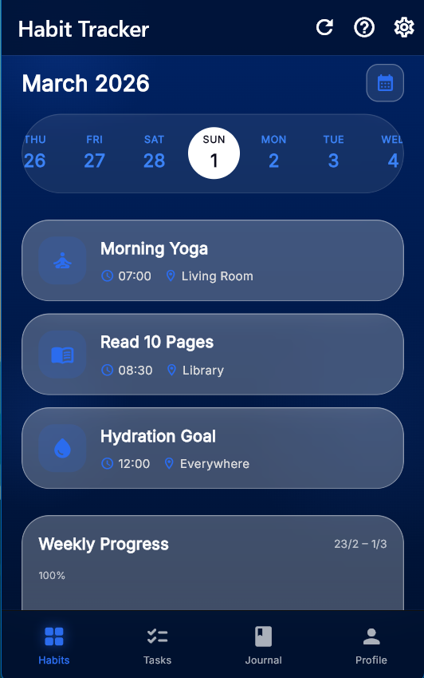
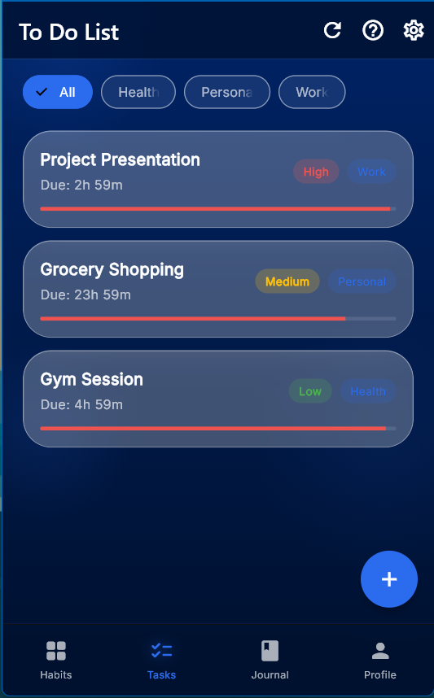
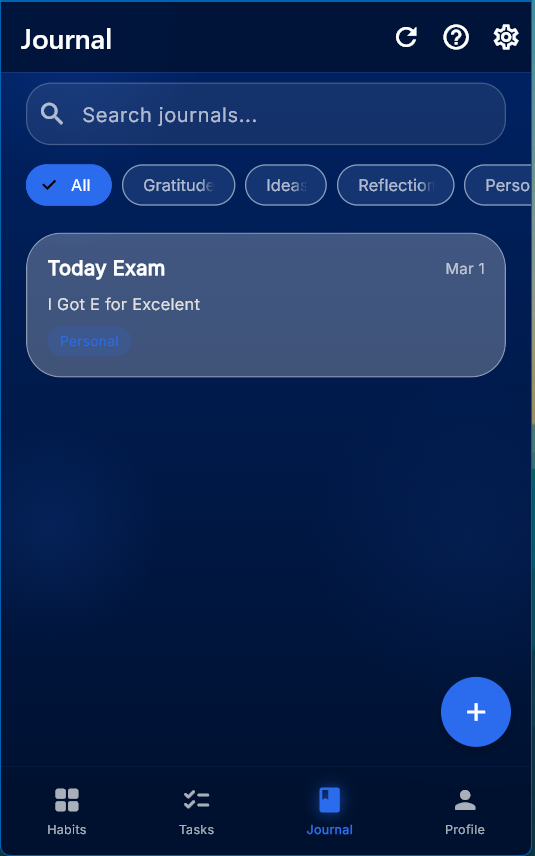

# DailyLife

A beautiful, sleek, and intuitive **Habit Tracker, To-Do List, and Journal** app built with **Flutter**. Designed with a breathtaking **glassmorphism** aesthetic, DailyLife helps you organize your days, track your habits, and reflect on your growth gracefully.

---

## Aesthetic & Design

DailyLife embraces a sophisticated **Dark Glassmorphism** theme:

- Deep sapphire and glowing blue accents (`#0A1628` background, `#3B82F6` glows).
- Frosted glass cards with background blur (`BackdropFilter`).
- Fluid animations, pill-shaped horizontal calendars, and clean typography (`Google Fonts - Outfit`).

## Features

### 1. Habit Tracker

- Vertical tracking to build discipline with visual daily streaks.
- Quick horizontal **pill-shaped date picker** with snap-to-center physics.
- **Swipe actions**: Swipe left to mark **Done** (Green), swipe right to **Skip** (Yellow).
- Dynamic progress charts synced to your history.

### 2. To-Do List

- Organize tasks with dynamic priorities (High, Medium, Low/Routine).
- Track deadlines with dynamic, color-coded progress bars.
- **Categorization**: Create and assign custom tags or filter out existing routines.
- Expandable cards with seamless cross-fade animations for descriptions.
- **Swipe actions**: Swipe to complete or skip tasks in your list.

### 3. Personal Journal

- Document your memories, ideas, and reflections.
- Custom tag organizations (e.g., Gratitude, Work, Reflection, or your own!).
- Persistent, offline storage for your private notes.

### 4. Developer / Edit Mode

- Toggle **Edit Mode** via the app bar for advanced actions.
- **Multi-select**: Select multiple habits, tasks, or journals for batch deletion.
- **Undo / Redo**: Made a mistake? Seamlessly revert your modifications (up to the entire lifetime of your current session) with robust state snapshots.

## 🛠 Tech Stack

- **Framework:** [Flutter](https://flutter.dev/) (SDK ^3.11.0)
- **State Management:** [Riverpod](https://riverpod.dev/) (`flutter_riverpod` - Notifier API used for undo/redo and robust architectural separation)
- **Local Storage:** [Hive](https://docs.hivedb.dev/) (`hive_flutter` for blazing fast NoSQL persistence)
- **Charting:** [`fl_chart`](https://pub.dev/packages/fl_chart) for habit statistics
- **Routing:** [`go_router`](https://pub.dev/packages/go_router)

## Getting Started

### Prerequisites

Make sure you have Flutter installed on your machine.

- [Install Flutter](https://docs.flutter.dev/get-started/install)
- Verify installation by running `flutter doctor`

### Installation

1. **Clone the repository:**

   ```bash
   git clone https://github.com/your-username/daily_life.git
   cd daily_life
   ```

2. **Install Dependencies:**

   ```bash
   flutter pub get
   ```

3. **Run the App:**
   ```bash
   flutter run
   ```

## Screenshots

|              Habits Tracker               |                To-Do List                |                  Journal                   |
| :---------------------------------------: | :--------------------------------------: | :----------------------------------------: |
|  |  |  |

## Contributing

Contributions, issues, and feature requests are welcome! Feel free to check the [issues page](https://github.com/Syaasr/DailyLife/issues).

## License

This project is open-source and available under the [MIT License](LICENSE).
